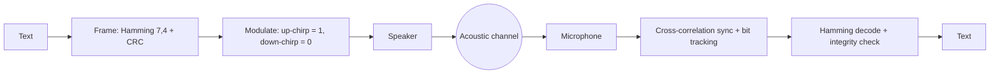

# chirp-comm

[](https://github.com/WallyHao/chirp-comm/actions/workflows/ci.yml)
[](LICENSE)
[](pyproject.toml)
[](https://github.com/astral-sh/ruff)
[](tests)

**Send short text between devices using nothing but a speaker and a microphone.**

chirp-comm is a small acoustic communication library. It encodes text into a
stream of linear chirps in the 2-4 kHz band, transmits it over sound, and
decodes it again on the receiving device. It works with no network, no radio
and no pairing, which makes it useful for offline device hand-off, smart-home
triggers and teaching digital communication.

## How It Works



- **Chirp keying.** Each bit is a 50 ms linear chirp: rising for `1`, falling
  for `0`. A 0.15 s rising sync chirp marks the start of every frame, and every
  symbol is Hann-windowed to limit spectral splatter.
- **Forward error correction.** Each 4-bit nibble is encoded with a Hamming(7,4)
  code that corrects any single-bit error per codeword.
- **Robust framing.** A sync chirp plus per-bit parity and a trailing check
  field let the receiver resynchronise and reject corrupted frames.
- **Dynamic bit tracking.** The receiver follows the correlation peak from bit
  to bit instead of assuming a fixed clock, which absorbs timing drift.

## Install

```bash
git clone https://github.com/WallyHao/chirp-comm.git
cd chirp-comm
pip install -e ".[dev]"     # add ".[viz]" for the matplotlib diagnostics
```

The core library needs `numpy`, `scipy` and `sounddevice`. `scipy` and
`sounddevice` are imported lazily, so importing the package and running the
tests works on a machine with no audio device.

## Quickstart

Generate a clean frame and decode it offline:

```bash
python examples/generate_to_file.py --clean
python examples/analyze_signal.py samples/clean.wav
```

Transmit and receive between two devices:

```bash
# on the sender
python examples/transmit_live.py "ab"

# on the receiver
python examples/record_and_decode.py
```

Use the library directly:

```python
from chirp_comm import ChirpProtocol

bits = ChirpProtocol.encode_to_bits("ab")
text = ChirpProtocol.decode_from_bits(bits)
print(text)  # "ab"
```

## Interference Evaluation Set

`examples/generate_to_file.py` builds a reproducible set of 19 WAV samples
across eleven interference categories, and `examples/analyze_signal.py`
reports the decode rate for each one:

| File | Interference |
| --- | --- |
| `01_clean.wav` | Baseline, no interference |
| `02_gaussian_snr{5,10,15,20}.wav` | Additive white Gaussian noise |
| `03_pink_noise.wav` | Coloured noise |
| `04_hum_{50,100}hz.wav` | Mains hum |
| `05_burst_noise.wav` | Short high-amplitude bursts |
| `06_dropout.wav` | Signal dropouts |
| `07_volume_{10,30,50}.wav` | Attenuation |
| `08_doppler_{+50,-50,+200}hz.wav` | Frequency offset |
| `09_reverb.wav` | Multipath / reverb |
| `10_clicks.wav` | Impulse (click) noise |
| `11_combined.wav` | Several impairments at once |

```bash
python examples/analyze_signal.py samples/
```

## Project Layout

```text
chirp_comm/
  config.py      Timing, frequency and framing constants
  dsp.py         Chirp generation, Hamming(7,4), bandpass filter
  protocol.py    Text <-> bitstream framing
  engine.py      Transmitter and Listener (live audio)
  audio_io.py    Async microphone input stream
  packet.py      AcousticPacket container
  diagnostics.py Optional waveform/spectrum plots
examples/        Sample generator, analyzer and live demos
tests/           Pytest suite for the codec and framing layers
```

## Development

```bash
ruff check .
ruff format --check .
pytest -q
```

CI runs these on Python 3.9 to 3.12. See [`CONTRIBUTING.md`](CONTRIBUTING.md).

## License

Released under the [MIT License](LICENSE).
